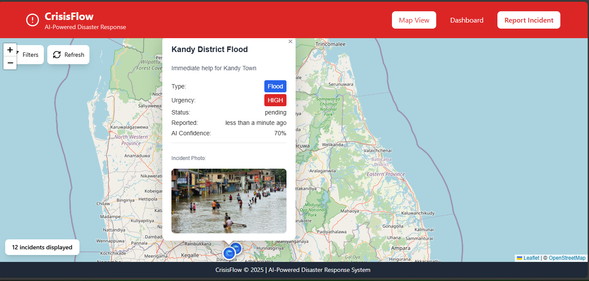
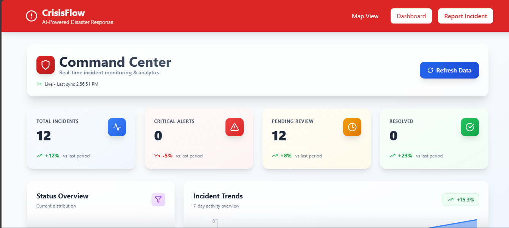
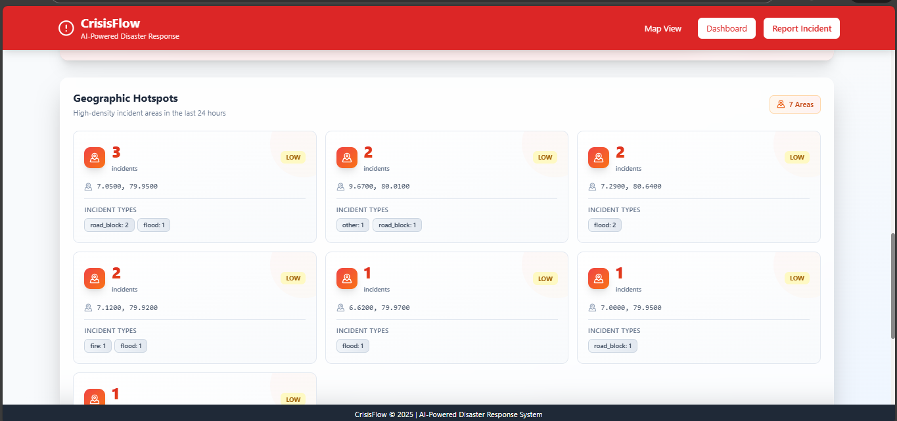
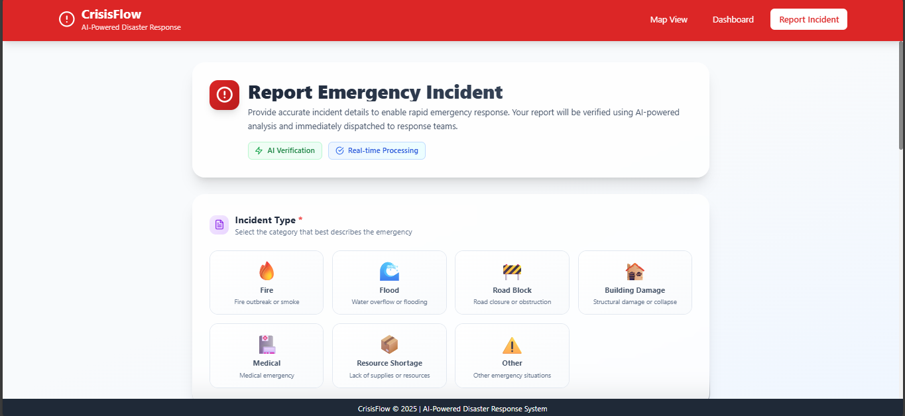

# 🚨 CrisisFlow - AI-Powered Disaster Response Platform

[](LICENSE)
[](https://www.python.org/)
[](https://fastapi.tiangolo.com/)
[](https://reactjs.org/)
[](https://www.docker.com/)

An intelligent disaster response platform that leverages state-of-the-art AI/ML models to analyze, classify, and coordinate emergency incidents in real-time. CrisisFlow combines computer vision, natural language processing, and geospatial analytics to streamline disaster management operations.

## 📸 Screenshots

### Interactive Map View with Incident Photos

*Real-time incident mapping with photo popups showing disaster details and AI analysis*

### Command Center Dashboard

*Live statistics, trends analysis, and KPI monitoring for emergency response coordination*

### Geographic Hotspots Analysis

*High-density incident areas visualization for resource allocation*

### Incident Reporting Interface

*User-friendly incident submission form with AI verification and location search*

## 🌟 Key Features

### 🤖 Advanced AI/ML Capabilities

- **Multi-Modal Computer Vision** (EfficientNetV2 + CLIP)
  - Multi-label disaster classification (Fire, Flood, Safe)
  - 512-dimensional semantic embeddings via CLIP ViT-B/32
  - Intelligent duplicate detection using pgvector cosine similarity (>95% threshold)
  - Real-time image verification and metadata extraction

- **Zero-Shot Natural Language Processing** (GLiNER)
  - Multilingual entity extraction (English, Sinhala, Singlish)
  - Automated urgency level assessment
  - Extraction of: Location, Resources Needed, Person Count, Contact Info
  - Handles fragmented and noisy SOS messages

- **Geospatial Intelligence** (PostGIS Integration)
  - Spatial clustering using ST_ClusterDBSCAN
  - Real-time incident mapping with Leaflet.js
  - Heatmap visualization for hotspot identification
  - Geographic proximity analysis

### 📊 Real-Time Dashboard & Analytics

- Live statistics and KPI monitoring
- Interactive incident timeline with trend analysis
- Cluster visualization and hotspot identification
- Resource allocation insights
- Multi-criteria filtering (Status, Type, Urgency, Time)

### 🗺️ Interactive Map Interface

- Real-time incident markers with custom icons
- Color-coded urgency levels
- Cluster markers for grouped incidents
- Popup details with images and AI analysis
- Mobile-responsive design

### 📝 Incident Reporting System

- Multipart form submission with image upload
- Automatic AI analysis on submission
- Geolocation capture
- Contact information collection
- Real-time validation and feedback

## 🏗️ Architecture Overview

CrisisFlow follows a modern microservices architecture with clear separation of concerns:

```
┌─────────────────────────────────────────────────────────────┐
│                        Frontend Layer                        │
│  React 18 + Vite + TailwindCSS + Leaflet + Recharts        │
└────────────────────────┬────────────────────────────────────┘
                         │ REST API (Axios)
┌────────────────────────┴────────────────────────────────────┐
│                     Backend API Layer                        │
│           FastAPI + Uvicorn (Async/Await)                   │
│  ┌──────────┐  ┌──────────┐  ┌──────────┐  ┌──────────┐  │
│  │Incidents │  │Dashboard │  │   AI     │  │  Health  │  │
│  │   API    │  │   API    │  │   API    │  │   Check  │  │
│  └──────────┘  └──────────┘  └──────────┘  └──────────┘  │
└────────────────────────┬────────────────────────────────────┘
                         │
┌────────────────────────┴────────────────────────────────────┐
│                      AI/ML Services                          │
│  ┌─────────────────┐  ┌─────────────────┐  ┌────────────┐ │
│  │  Vision Agent   │  │   NLP Parser    │  │ Clustering │ │
│  │ EfficientNetV2  │  │     GLiNER      │  │   PostGIS  │ │
│  │   + CLIP        │  │  (Zero-Shot)    │  │  DBSCAN    │ │
│  └─────────────────┘  └─────────────────┘  └────────────┘ │
└────────────────────────┬────────────────────────────────────┘
                         │
┌────────────────────────┴────────────────────────────────────┐
│                    Database Layer                            │
│  PostgreSQL 15 + PostGIS + pgvector                         │
│  ┌──────────────┐  ┌──────────────┐  ┌──────────────┐     │
│  │   Incidents  │  │   Spatial    │  │    Vector    │     │
│  │     Table    │  │   Indexes    │  │  Embeddings  │     │
│  └──────────────┘  └──────────────┘  └──────────────┘     │
└─────────────────────────────────────────────────────────────┘
```

See [ARCHITECTURE.md](ARCHITECTURE.md) for detailed system design documentation.

## 🚀 Quick Start

### Prerequisites

- **Docker** (v20.10+) and **Docker Compose** (v2.0+)
- **Git**
- At least **8GB RAM** (for AI model inference)
- **10GB** free disk space

### Installation

1. **Clone the repository**
```bash
git clone https://github.com/yourusername/crisis-flow-project.git
cd crisis-flow-project
```

2. **Start the application with Docker Compose**
```bash
docker-compose up --build
```

This will start:
- **Frontend**: http://localhost:5173
- **Backend API**: http://localhost:8000
- **API Docs**: http://localhost:8000/docs
- **PostgreSQL**: localhost:5432

3. **Wait for AI models to download** (first run only, ~2-3 minutes)
```
✓ Loading EfficientNetV2 on cpu...
✓ Loading CLIP ViT-B/32 on cpu...
✓ Loading GLiNER model on cpu...
✓ Vision models loaded successfully
```

4. **Access the application**
- Open your browser to http://localhost:5173
- Create your first incident report with an image
- View AI analysis results in real-time

### Alternative: Local Development Setup

#### Backend Setup
```bash
cd backend
python -m venv venv
source venv/bin/activate  # Windows: venv\Scripts\activate
pip install -r requirements.txt
uvicorn app.main:app --reload
```

#### Frontend Setup
```bash
cd frontend
npm install
npm run dev
```

#### Database Setup
```bash
# Using Docker for PostgreSQL
docker run -d \
  --name crisisflow_db \
  -e POSTGRES_DB=crisisflow_db \
  -e POSTGRES_USER=postgres \
  -e POSTGRES_PASSWORD=postgres \
  -p 5432:5432 \
  pgvector/pgvector:pg15
```

## 📚 API Documentation

### Interactive API Documentation

Once the backend is running, visit:
- **Swagger UI**: http://localhost:8000/docs
- **ReDoc**: http://localhost:8000/redoc

### Core Endpoints

#### Incidents API
```http
POST   /api/v1/incidents          # Create new incident (multipart/form-data)
GET    /api/v1/incidents          # List incidents with filters
GET    /api/v1/incidents/{id}     # Get incident details
PATCH  /api/v1/incidents/{id}     # Update incident
DELETE /api/v1/incidents/{id}     # Delete incident
```

#### Dashboard API
```http
GET    /api/v1/dashboard/stats    # Get dashboard statistics
GET    /api/v1/dashboard/clusters # Get spatial clusters
GET    /api/v1/dashboard/heatmap  # Get heatmap data
GET    /api/v1/dashboard/timeline # Get incident timeline
```

#### AI Analysis API
```http
POST   /api/v1/ai/analyze-image   # Analyze disaster image
POST   /api/v1/ai/analyze-text    # Parse SOS text
GET    /api/v1/ai/models/status   # Check AI model status
```

### Example: Create Incident with AI Analysis

```bash
curl -X POST "http://localhost:8000/api/v1/incidents" \
  -H "Content-Type: multipart/form-data" \
  -F "latitude=6.9271" \
  -F "longitude=79.8612" \
  -F "title=Severe flooding in Colombo" \
  -F "description=Water level rising fast. Need rescue boats for 20 families trapped" \
  -F "incident_type=flood" \
  -F "reporter_name=John Doe" \
  -F "reporter_contact=+94771234567" \
  -F "image=@flood_photo.jpg"
```

Response:
```json
{
  "id": 123,
  "title": "Severe flooding in Colombo",
  "urgency_level": "critical",
  "ai_confidence_score": 0.89,
  "ai_detected_classes": [
    {"label": "flood", "confidence": 0.94},
    {"label": "safe", "confidence": 0.11}
  ],
  "ai_extracted_entities": {
    "location": ["Colombo"],
    "person_count": ["20 families"],
    "resource_needed": ["rescue boats"]
  },
  "is_duplicate": false,
  "status": "pending",
  "created_at": "2025-12-10T08:30:00Z"
}
```

## 🧪 Testing

### Backend Tests
```bash
cd backend
pytest tests/ -v
```

Available test suites:
- `test_system.py` - System integration tests
- `test_ai_features.py` - AI model tests
- `test_fake_detection.py` - Image verification tests

### Frontend Tests
```bash
cd frontend
npm run lint
```

## 🔧 Configuration

### Environment Variables

Create `.env` file in the backend directory:

```env
# Database
DATABASE_URL=postgresql://postgres:postgres@db:5432/crisisflow_db

# Application
APP_NAME=CrisisFlow
DEBUG=True
ALLOWED_ORIGINS=["http://localhost:5173", "http://localhost:3000"]

# AI Models
TORCH_DEVICE=cpu  # or "cuda" for GPU
MODEL_CACHE_DIR=/root/.cache

# File Upload
UPLOAD_DIR=./uploads
MAX_FILE_SIZE=10485760  # 10MB

# Clustering Parameters
CLUSTER_EPS=0.005  # ~500 meters
CLUSTER_MIN_POINTS=3
```

### Frontend Configuration

Edit `frontend/.env` or `vite.config.js`:

```env
VITE_API_URL=http://localhost:8000
```

## 📊 Technology Stack

For a comprehensive breakdown of all technologies used, see [TECHNOLOGY_STACK.md](TECHNOLOGY_STACK.md).

### Core Technologies

| Layer | Technology | Version | Purpose |
|-------|-----------|---------|---------|
| Frontend | React | 18.2.0 | UI Framework |
| Frontend | Vite | 5.0.11 | Build Tool |
| Frontend | TailwindCSS | 3.4.1 | Styling |
| Frontend | Leaflet.js | 1.9.4 | Maps |
| Backend | FastAPI | 0.109.0 | API Framework |
| Backend | Python | 3.11+ | Runtime |
| AI/ML | PyTorch | 2.9.1 | Deep Learning |
| AI/ML | CLIP | Latest | Vision Embeddings |
| AI/ML | GLiNER | 0.2.8 | NLP Entity Extraction |
| Database | PostgreSQL | 15 | Primary Database |
| Database | PostGIS | Latest | Spatial Extension |
| Database | pgvector | 0.2.5 | Vector Similarity |

## 🤝 Contributing

We welcome contributions! Please follow these steps:

1. Fork the repository
2. Create a feature branch (`git checkout -b feature/AmazingFeature`)
3. Commit your changes (`git commit -m 'Add some AmazingFeature'`)
4. Push to the branch (`git push origin feature/AmazingFeature`)
5. Open a Pull Request

### Development Guidelines

- Follow PEP 8 for Python code
- Use ESLint rules for JavaScript/React
- Write unit tests for new features
- Update documentation for API changes
- Keep commits atomic and well-described

## 📈 Performance Metrics

- **AI Inference Speed**: ~200-500ms per image (CPU)
- **API Response Time**: <100ms (avg)
- **Database Query Time**: <50ms (indexed queries)
- **Frontend Load Time**: <2s (initial load)
- **Concurrent Users**: 100+ (tested)

## 🔒 Security Features

- Input validation and sanitization
- SQL injection prevention (SQLAlchemy ORM)
- XSS protection (React auto-escaping)
- CORS configuration
- File upload restrictions
- Rate limiting ready (Redis integration possible)

## 📝 License

This project is licensed under the MIT License - see the [LICENSE](LICENSE) file for details.

## 🙏 Acknowledgments

- **OpenAI CLIP** - Vision-language model for semantic embeddings
- **Hugging Face** - GLiNER model hosting and transformer libraries
- **TIMM** - EfficientNetV2 implementation for computer vision
- **FastAPI** - High-performance async web framework
- **React & Vite** - Modern frontend development tools
- **PostGIS & pgvector** - Spatial and vector database extensions
- **Leaflet.js** - Interactive mapping library

## 📧 Contact & Support

- **Issues**: [GitHub Issues](https://github.com/yourusername/crisis-flow-project/issues)
- **Documentation**: [ARCHITECTURE.md](ARCHITECTURE.md) | [TECHNOLOGY_STACK.md](TECHNOLOGY_STACK.md)
- **API Docs**: http://localhost:8000/docs (when running)

## 🗺️ Roadmap

### ✅ Current Features (v1.0)
- [x] AI-powered incident analysis (Vision + NLP)
- [x] Interactive real-time map interface
- [x] Analytics dashboard with visualizations
- [x] RESTful API with auto-generated documentation
- [x] Geospatial clustering and duplicate detection
- [x] Docker containerization for easy deployment

### 🚀 Upcoming (v2.0)
- [ ] User authentication and authorization
- [ ] Redis caching for improved performance
- [ ] Real-time WebSocket notifications
- [ ] Multi-language support
- [ ] SMS/WhatsApp integration
- [ ] Mobile-responsive enhancements

### 💡 Future Enhancements
- [ ] Mobile applications (iOS/Android)
- [ ] Predictive analytics using historical data
- [ ] Integration with emergency services APIs
- [ ] IoT sensor data integration
- [ ] Progressive Web App (PWA) with offline support

---

